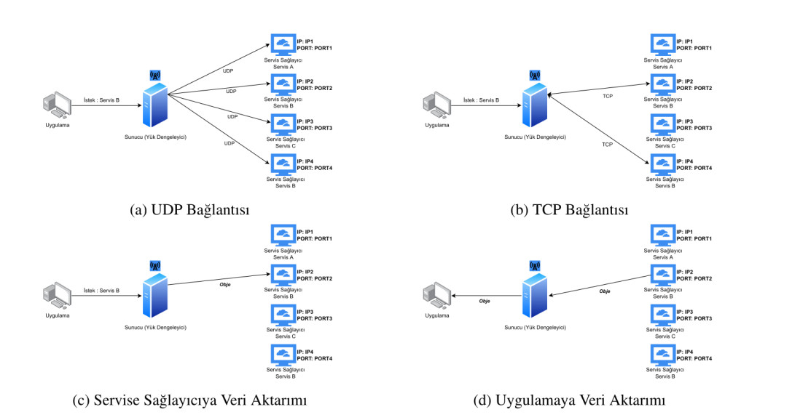
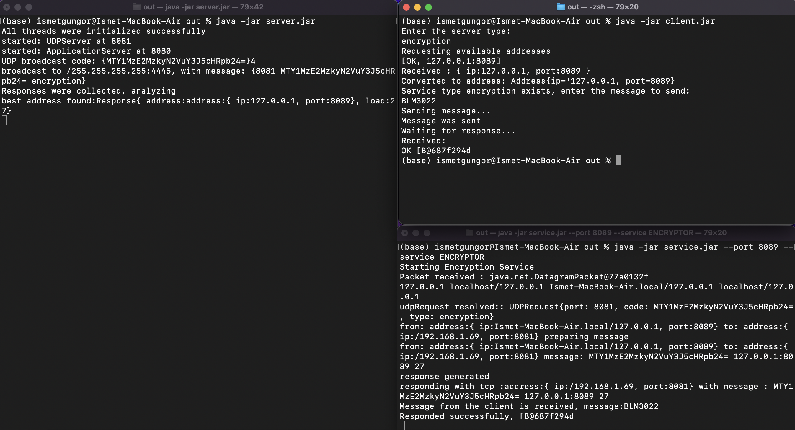

<p align="center">
  <a href="https://github.com/umutsevdi/service-discovery">
    </a>
<h3 align="center"> Service Discovery and Load Balancing Service</h3>

<p align="center"> Service Discovery & Load Balancing service implementation using UDP broadcasting and TCP 
  <br />
    <i>Developed by <a href="https://github.com/umutsevdi"> Umutcan Sevdi</a>, <a href="https://github.com/ismetgngr">İsmet Güngör</a>, <a href="https://github.com/MetinUsta">Metin Usta</a> and <a href="https://github.com/emrearslanoglu">Emre Arslanoğlu</a>.</i>

<p align="center"><a href="doc/AgTeknolojileriServiceDiscovery.pdf"><strong>Explore the docs »</strong></a></p>

<details open="open">
  <summary>Table of Contents</summary>
  <ol>
    <li><a href="#project_definition">Project Definition</a></li>
    <li><a href="#system_architecture">System Architecture</a></li>
    <li><a href="#structure">Project Structure</a></li>
    <li><a href="#performance">Performance Analysis</a></li>
    <li><a href="#screenshots">Screenshots</a></li>
    <li><a href="#installation">Installation</a></li>
    <li><a href="doc/AgTeknolojileriServiceDiscovery.pdf">Documentation</a></li>
    <li><a href="LICENSE">License</a></li>
    <li><a href="#contact">Contact</a></li>
  </ol>
</details>

<p id="project_definition">

## 1- Project Definition

Service providing systems generally start as small-sized projects. However, over
time they need methods to scale their systems to keep up with the incoming demand.
Sometimes these scaling mechanisms are improved throughout the lifecycle of the application.

Systems require additional tools and structures for the future to keep providing
services. One of these mechanisms is called Service Discovery. When the registry
handling and the discovery are done by an additional server, it is called
server-side service discovery.

Within the scope of our project, we will implement a server that combines the Service
Registry and the Load Balancer. However, instead of storing service provider addresses
in a database-like system, we will use UDP broadcasting to discover them.

<p align="center" ></p>

<p id="system_architecture">

## 2- System Architecture

The server and the client communicate through TCP. But the communication
between server and service applications are done through UDP.

The client requests a service using TCP to the server. When the server
receives the request sends a UDP broadcast message to all services.
If the application services type matches the client's request,
they respond to this message with their IP address, port number and a number
corresponding to their busyness, using TCP.

<p align="center"></p>

The server waits until the timeout and saves all responses during that time.
After the timeout, the server analyzes all responses and selects the best service.
Then sends its IP and port values to the client.

After that, the service application and client communicate directly through TCP.

<p align="center"></p>

<p id="structure">

## 3- Structure

The project includes three applications:

- <a href="client/">Client</a> is the application that represents the
  end-user. It sends the type of service application the user would like to
  interact with to the server and connects to the best available server.
  Then client application sends TCP requests to the application servers.
- <a href="server/">Server</a> is the load balancer and the service
  discoverer. Upon receiving a TCP request from clients, searches given query using
  UDP broadcast and registers incoming requests. Selects the best available server
  and returns its address to the client.
- <a href="service/">Service</a> is the service application. It represents
  backend applications in which clients interact. Upon receiving a UDP broadcast
  from the server, the service's UDP module responds to it with its load.
  Then it executes application programs for the clients.

```txt
service-discovery/
├── client
│   └── src
│       ├── data
│       │   └── Address.java
│       └── Main.java
├── server
│   └── src
│       ├── ApplicationServer.java
│       ├── data
│       │   ├── Address.java
│       │   └── ServerResponse.java
│       ├── exception
│       │   ├── NoResponseException.java
│       │   └── TimeoutException.java
│       ├── Main.java
│       └── UDPServer.java
└── service
    └── src
        ├── data
        │   ├── Address.java
        │   └── UDPRequest.java
        ├── exception
        │   └── InvalidRequestException.java
        ├── executor
        │   ├── DateTime.java
        │   ├── DNSLookup.java
        │   ├── Encryptor.java
        │   ├── EvaluateExpression.java
        │   └── Executor.java
        ├── GenericExecutionServer.java
        ├── Main.java
        └── UDPResponseServer.java
```

<p id="performance">

## 4- Performance Analysis

In this section, we examined our system's performance.

It is hard to determine the efficiency of such a system with arithmetic
calculations. Using UDP broadcasting to determine services may look like
it's creating an overhead. However, it also provides speed since it doesn't
spend time on database transactions and data synchronizations.

It will also make adding new servers or removing existing ones easier.
Adding new services will have little or no effect on the server's architecture.

### 4.1- Alternative Scenerio

When the system was initially designed, the server was also responsible for
 the data transfer between the client and the service. Although this creates anonymity
over service applications, it was also causing an increase in the response time.
<p align="center"></p>

### 4.2- Revised System

In our system, the server is responsible for both server discovery and load
balancing. So adding data transfer would cause heavyweight. To reduce its
load, we changed the way our system works. When the load balancer detects the
services, it returns its address information to the client. Then client
directly connects to those services. This way server can perform data
transfers more efficiently.

<p align="center"></p>

<p id="screenshots">

## 5- Screenshots

- DNS Lookup service running on MacOS.


- Encryption service running on MacOS.




<p id="installation">

### 6- Installation

1. Clone the repo

```sh
   git clone https://github.com/umutsevdi/service-discovery.git
```

2. Run following command to create Load Balance and Discovery server.

```sh
    java -jar out/server.jar
```

3. Run following command on a seperate terminal to run client.

```sh
    java -jar out/client.jar
```

4. Run following command on a seperate terminal to execute a service.

```sh
    java -jar out/service.jar --port 8083 --service DNS_LOOKUP
```

## 7- Documentation

Read the full documentation from <a href="doc/AgTeknolojileriServiceDiscovery.pdf">here</a>.

## 8- License

Distributed under the MIT License. See `LICENSE` for more information.

<p id="contact">

## 9- Contact

You can contact any developer of this project for any suggestion or information.

Project: [umutsevdi/service-discovery](https://github.com/umutsevdi/service-discovery)

<i>Developed by <a href="https://github.com/umutsevdi"> Umutcan Sevdi</a>, <a href="https://github.com/ismetgngr">İsmet Güngör</a>, <a href="https://github.com/MetinUsta">Metin Usta</a> and <a href="https://github.com/emrearslanoglu">Emre Arslanoğlu</a>.</i>
